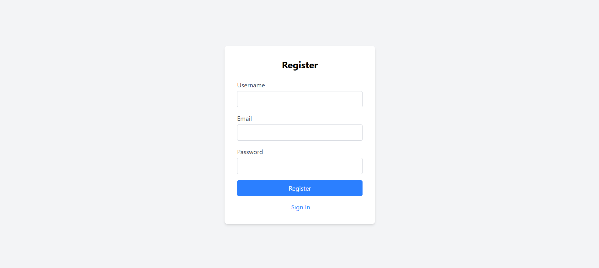
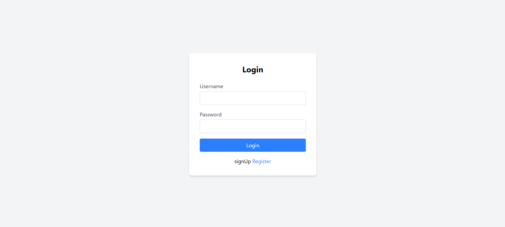
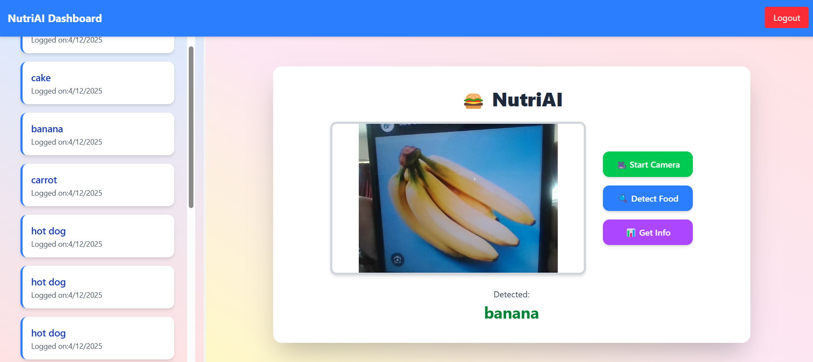
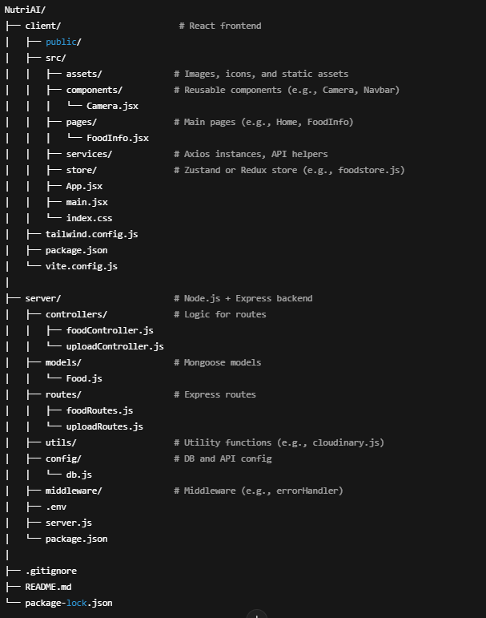

# 🍽️ NutriAI – Smart Food Detection and Nutrition Tracking App

NutriAI is a MERN stack application that allows users to detect food items using a camera, view nutritional information powered by TensorFlow and custom data, and keep track of their daily intake. It includes user authentication (JWT), image upload via Cloudinary, and a modern UI using Tailwind CSS and Framer Motion.

---

## 📷 Preview Screens

### 📝 Register Page  

### 🔐 Login Page  

### 📊 Dashboard (Logs + Camera Access)  

### 🍔 Food Details Page  

---

## 🧠 Features

- 📷 **Camera Integration** for live food capture  
- 🍔 **Food Detection** using TensorFlow (YOLO or custom model)  
- 📦 **Cloudinary Upload** of captured images  
- 🧾 **Nutritional Breakdown** based on identified food  
- 🗂️ **Daily Nutrition Logs** stored in MongoDB  
- 🔐 **User Authentication** with JWT (Login/Register)  
- 🌐 **Modern Responsive UI** with Tailwind CSS + Framer Motion  
- 🧠 **GPT-powered tips** (optional feature)

---

## 🛠️ Tech Stack

**Frontend**:  
- React.js  
- Tailwind CSS  
- React Router  
- Framer Motion  

**Backend**:  
- Node.js  
- Express.js  
- MongoDB + Mongoose  
- JWT Authentication  
- Cloudinary (for image storage)

**ML Integration**:  
- TensorFlow.js or Flask API for ML inference  

---

## 📁 Project Structure

